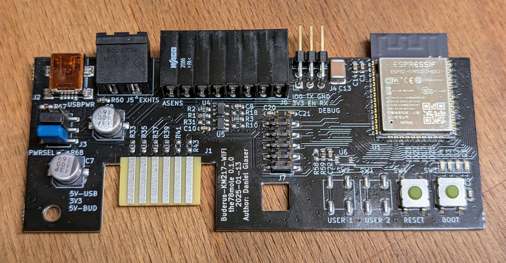
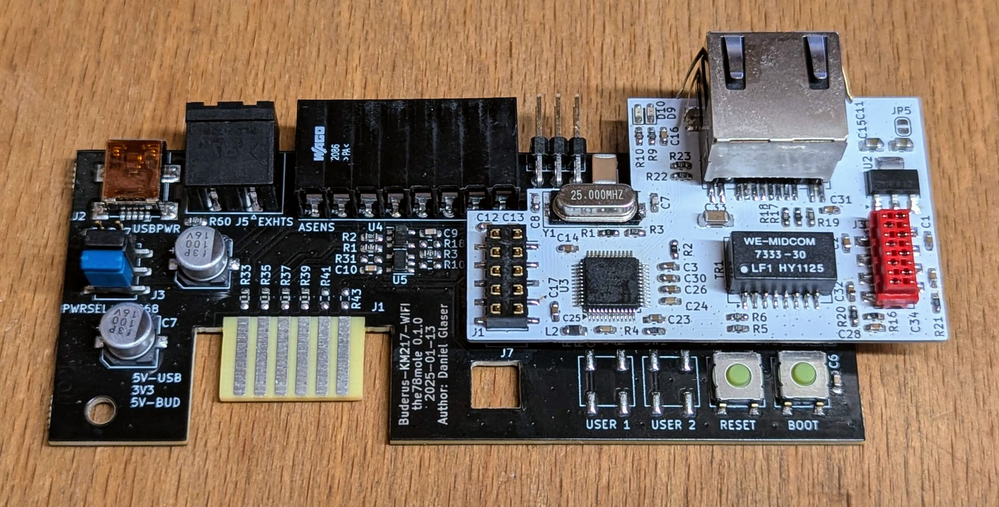

# KM271-WiFi Schnellstart

Dies ist eine kurze Anleitung zur Inbetriebnahme des KM271-WiFi-Moduls.

## Voraussetzungen

Überprüfe zunächst, ob alles wie bestellt vorhanden ist (von links nach rechts):

- **J5** ist der Anschluss für den Abgastemperatursensor (das Gegenstück lag dem Paket bei, Farben können abweichen: schwarz oder grün)
- **J6** ist der Anschluss für Sensorleitungen
- **J4** ist der Debug-Anschluss zur Programmierung über eine serielle Verbindung

Je nach Bestellung und gewählten Optionen sind einige Anschlüsse möglicherweise nicht bestückt. Die Ethernet-Erweiterung auf dem zweiten Bild ist ein separates Modul, das ebenfalls in meinem Tindie-Shop erhältlich ist.

Nun **prüfe, ob der PWRSEL-Header** wie im Bild gezeigt bestückt ist. Der mittlere und der untere Jumper sollten gesteckt sein. Dies ist die korrekte Variante für die **Versorgung über die Buderus-Steuerung**. Wenn du das Modul **über USB versorgen** willst, musst du den unteren Jumper (blau im Bild) nach oben versetzen. Orientiere dich dabei an der Beschriftung unter dem Kondensator. Der schwarze Jumper darf nur zum Flashen über die serielle Schnittstelle entfernt werden.

Für die Ethernet-Erweiterung prüfe: J5 ist geschlossen, J4 ist offen, und die Jumper J1 bis J3 sitzen auf den Positionen 2–3.

## Einbau

Wenn du Ethernet nutzen möchtest, ist jetzt der richtige Zeitpunkt, die Ethernet-Erweiterung aufzustecken.

1. Schalte die Buderus-Steuerung aus  
2. Entferne die beiden Schrauben des Gehäuses und hebe es vorsichtig an  
3. Biege die über dem KM271-Slot verlaufenden Kabel etwas nach oben, sodass das Modul seitlich eingeschoben werden kann  
4. Richte das Modul in den Führungsschienen des KM271 aus und schiebe es nach unten  
5. Drücke das Modul vorsichtig in den Steckplatz – es rastet mit einer kleinen Lasche in die rechteckige Öffnung des KM271-Moduls ein (im Bild neben dem Flachsteckverbinder). Wenn du das Modul wieder entfernen möchtest, entriegle die Lasche mit einem Schraubendreher  
6. Schließe ggf. weitere Sensoren an: Abgastemperaturfühler, Ölzähler, OneWire usw.  
7. Setze das Gehäuse der Buderus-Steuerung wieder auf  
8. Schalte die Steuerung wieder ein

Auf dem Display der Buderus-Steuerung sollte nun ein neuer Eintrag `ABGAS` oder `EXHAUST` erscheinen. Falls nicht, nutze das Drehrad zur Navigation. Wenn du einen Abgastemperaturfühler angeschlossen hast, wird dessen aktuelle Temperatur angezeigt. Falls nicht, steht dort `---` – das ist völlig in Ordnung.

Nun nimm dein Smartphone oder einen PC und suche nach dem WLAN `Fallback Hotspot` (bei ESPhome) oder `ESP-Buderus-KM271` (bei dewennis Firmware). Auf Android fragt das Gerät nach 10–20 Sekunden, ob du verbunden bleiben möchtest (da keine Internetverbindung vorhanden ist) – bestätige mit `Ja`. Öffne dann den Browser und rufe die Adresse http://192.168.4.1 auf. Manchmal dauert es einige Minuten, bis eine Verbindung aufgebaut oder die Seite geladen ist (vermutlich ein Bug in ESPhome). Bis zu diesem Punkt ist das Vorgehen bei dewennis Firmware identisch – sie reagiert meist nur etwas schneller. Fahre jetzt mit dem passenden Kapitel zu deiner Firmware fort.

### ESPhome-Konfiguration

Du solltest nun die Seite des Fallback-Hotspots sehen:

Wähle dein WLAN und gib das Passwort ein. Wenn du versehentlich das falsche WLAN gewählt hast, ist es später schwierig, wieder Zugriff auf das Board zu bekommen. In diesem Fall musst du das falsche WLAN deaktivieren oder das Modul außerhalb der Reichweite bringen. Alternativ kannst du das Modul aus der Buderus-Steuerung entfernen und per USB versorgen und aus dem Empfangsbereich rausgehen (dazu den PWRSEL-Jumper umsetzen). Danach kannst du die Einrichtung erneut starten.

Auf der Seite des Fallback-Hotspots kannst du auch eine neue Firmware flashen – allerdings **keine andere Firmware** (z. B. die von dewenni).

Nach der Einrichtung sollte das Board in deinem ESPhome-Addon in Home Assistant erscheinen. Du kannst nun die YAML-Konfiguration anpassen oder so lassen, wie sie ist. Wenn eine neue Firmware verfügbar ist (z. B. durch ein Update des Addons), kann diese in der Regel problemlos eingespielt werden.

Das Gerät und seine Sensoren, Werte usw. findest du in Home Assistant unter:  
**Einstellungen → Geräte & Dienste → ESPhome**

Weitere Informationen findest du hier:  
https://github.com/the78mole/ESPhome-KM271-WiFi

### Dewennis MQTT-Konfiguration

Beim ersten Zugriff auf dewennis Web-Oberfläche solltest du zunächst die GPIOs konfigurieren – insbesondere, wenn du die Ethernet-Erweiterung (ETH-Ext) verwenden willst, um das KM271-WiFi mit deinem Heimnetz zu verbinden. Die GPIOs sind wie folgt:

| Signal | GPIO  | Pin (J7) |
|--------|-------|----------|
| VCC    |       | J7.2     |
| GND    |       | J7.10    |
| CLK    | 18    | J7.9     |
| MOSI   | 23    | J7.7     |
| MISO   | 19    | J7.5     |
| CS     | 15    | J7.3     |
| INT    | 14    | J7.8     |
| RST    | 13    | J7.6     |

Abgesehen von der Ethernet-Konfiguration kannst du alle weiteren Einstellungen auch nach dem Neustart vornehmen.

Danach musst du noch die GPIOs für die Verbindung zur Buderus-Steuerung konfigurieren. Für das KM271-WiFi gibt es eine vordefinierte Option – bitte wähle diese aus. Wenn du andere Hardware anschließen möchtest, findest du hier die detaillierte Beschreibung:

https://bit.ly/4jA7aHu

---

Für weitere Unterstützung kannst du meinem Matrix-Kanal beitreten:  
https://matrix.to/#/#molesblog:matrix.org

---

**Viel Spaß mit deinem Ölbrenner – bis ihn die Wärmepumpe in Rente schickt!**
