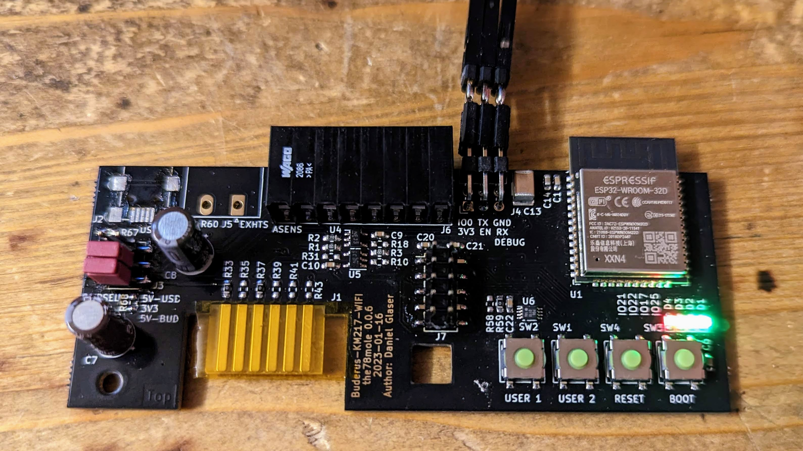
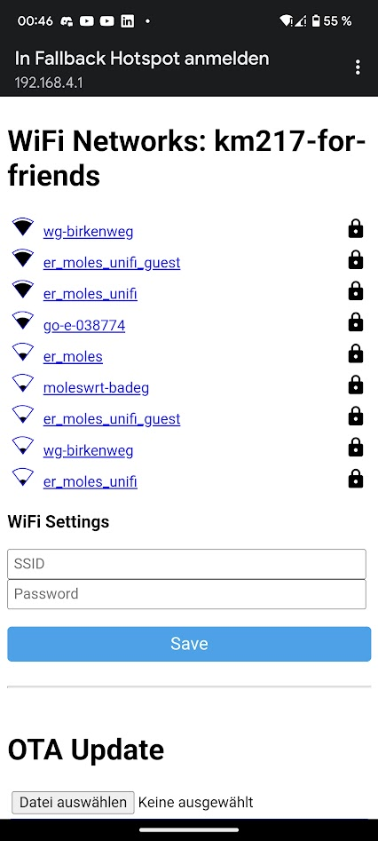

# KM271/KM217 WiFi

The current board as of version 0.0.6 got a bit more complicated than earlier versions. It was extended by many features requested from the community. I will explain the features and their options in the following parts.

First of all, KM271 and KM217 is totally the same. The KM271 is the original RS232 extension from Buderus and it was my fault, having a typo here in the early beginning, when first releasing the module to the public. Now many file names have the KM217 in their name and changing it would simply be a nightmare... So just call it as you like it :-) 

# Preparation and Installation of the Module

After unpacking the module, first thing you need to do is break off the two handling edges of the PCB. These are left-overs from manufacturing and I keep them attached, as they give additional protection to the edges of the board during transport. You can use a finger nail file to remove shrap edges.

You also need to remove the protective foil from the edge connector. These foils protect the contacts from solder tin during reworks (when applying the selected order options) and also from scratches to and oxidation of the finger contacts.

Now check, if the power select header (if populated) has the correct jumper settings (see section "Power Supply Options" section). When done, insert the card into your Buderus control unit. Detailed instructions on how to connect the board to your WiFi and Home Assistant can be found here: <a href="http://bit.ly/3IWEZ5z">http://bit.ly/3IWEZ5z</a>

In a few words, the path with ESPhome service running e.g. as a Home Assistant add-on is as follows:

- Power up the board with following options (if populated) by
  - inserting the module into the Buderus control unit
  - (optional) through USB connector (set J3 correctly)
  - (optional) through 3.3V on the debug, extension or sensor header
  - (optional) through 5V on the sensor header
- Wait for at least one minute for the fallback WiFi-AP to come up
- If you use your smartphone to connect: Switch of the mobile internet connection (3G/4G/LTE)
- Connect your Smartphone or PC to the Fallback WiFi network
- Your smartphone tells, that you need to login to access internet (follow this)
- You will be forwarded to the ESP inital configuration page (see image below)
- Select your home WiFi from the list of the page and enter your WiFi credentials
- Press `Save` to apply the settings
- Watch the Home Assistant Web UI for a notification to appear
- Follow this notification and select `Configure` for the ESPhome device that was found
- Now you can enter the ESPhome Web UI, adjust the YAML file to your needs and do an OTA firmware update

## Power Supply Options

When you receive the assembled board, it will be powered by the Buderus control unit by default. When there is no power supply header installed, two zero-ohm resistors select the supply:
  - Bridge from LDO output  to 3.3V of ESP
  - Bridge from Buderus 5V to the LDO input

If the power select header (J3) is installed, the two zero-ohm resistors are not populated. Therefore, two jumpers take over. These exactly mimic the behaviour of the zero-ohm resistors, when the board was assembled by me. This means in turn, even when a USB connector (J2) is assembled, the jumper configuration defaults to the Buderus supply, because I already had support requests complaining about non-functional boards with no USB power applied but jumpers set to USB supply.

But since some of the Buderus Heating Control units seem to have a weak power supply, some of the users of my extension suffer from, I added a USB power connector [Würth 65100516121](https://www.we-online.com/en/components/products/COM_SMT_MINI_TYPE_B_HORIZONTAL#65100516121) or [Reichelt USB BWM SMD](https://www.reichelt.de/usb-einbaubuchse-b-mini-gew-smd-montage-usb-bwm-smd-p52003.html) and the possibility to cut the supply from the 5V from Buderus. I'm not sure, if this is a problem of certain controllers equipped with a ton of original extensions or just scattering of good and bad supplies, but as soon as you attach other power hungry extensions to my board (like LC displays, many sensors,...), you should make use of this external power option.

For this purpose, I added a power select pin header (J3) with jumpers for the two 5V options (top = USB, bottom = Buderus) and if you want to supply 3.3V, you can cut-off the 3.3.V-LDO from the circuit with the middle Jumper.

If you populate the power select header yourself, do not forget to remove the two resistors R68 and R67.

## I2C

The I2C bus on the board is divided into two parts. The internal one running on 3.3V and an external one separated by a PCA9306 level shifter. 

### Internal I2C

The internal I2C parts are not soldered by default. One part is the EEPROM, another is the I2C-OneWire-Bridge. The GPIOs of the ESP32 used for it are:

| ESP32 Pin | Signal     | Description                                               |
|-----------|------------|-----------------------------------------------------------|
| IO16      | SCL        | I2C Clock Signal                                          |
| IO13      | SDA        | I2C Data Signal                                           |
| IO14      | nINT       | I2C Low-Active Open-Drain Interrupt Signal 3.3V !!!       |
| IO12      | I2C_EXT_EN | Enable (this is the EN input of the PCA9306 level-shifter |

#### I2C EEPROM

The EEPROM is meant to store persistent settings, that shall survive a full erase of the ESP32 flash and to persistently store data that is changed frequently and would damage the flash NVM quickly. Since my ESPhome firmware makes no use of it, I decided to not populate this, but keep other makers the opportunity to easily add one.

#### I2C-OneWire Bridge

Since I had a lot of positive experience using the OneWire bridge devices in the past, having more range than a GPIO-based solution, to be able to drive the bus with strong power, sharpening the rising edge with strong pull-up and release the firmware from many burdens (e.g. the search algorithm), I decided to add such a bridge to the board as an option. Unfortunately, ESPhome has not yet a component to support it. Maybe I'll develop one sooner or later. Feel free to take the challenge :-)

### External I2C 

The PCA9306 can be enabled by IO12 of the ESP32. The output voltage levels can be adjusted to your needs. By default, it is also tied to 3.3V, but moving the 0 Ohm resitance from R59 to R58, it can be set to 5V. In turn, the Pull-Ups R61 and R62 need to be unsoldered and replaced by Pull-Ups to 5V externally (this is a HW bug, I will fix in upcoming releases by tying them to the selectable supply of the PCA9306)

## OneWire

One wire is a very versatile bus, invented by Dallas, aquired by Maxim-IC and now is owned by Analog Devices. Nevertheless, still today new chips are released, extending the functionality of the OneWire bus more and more. The most widely known devices are the temperature sensors, namely the DS18B20. Up to 85°C, they do not even require a power supply and run completely from bus power. You can almost connect as many OneWire devices to the bus, as you want. There also exist switches, that can split your bus into segments and extend the range even further.

To address this wide spread sensors appropriately, I added an extension header to easily connect such devices and I also added a OneWire bus master (also known as I2C-OneWire-Bridge) to make even more use of it. Here are the OneWire relevant Pins:

| ESP32 Pin | Signal     | Description                                               |
|-----------|------------|-----------------------------------------------------------|
| IO32      | OW_TMP     |This is the direct path of the GPIO to OW, when you do not use the I2C-Bridge, if you use a bridge, it controls the bridges sleep mode |
| IO16      | SCL        |the SCL of the I2C to connect the bridge, unused for direct GPIO-OW |
| IO13      | SDA        |the SDA of the I2C to connect the bridge, unused for direct GPIO-OW |

The relevant parts of the OneWire feature are as follows:

If you want to use OneWire directly on ESP32 GPIO, you first need to fit in a 0 Ohm R66. With this, you can easily drive OneWire from IO. Additionally you need to populate R49 with an appropriate resistor to serve your needs. Depending on the bus load, the length and the devices in general, you should always try out different values. In my case (with relatively short lines), 1K often serverd well. But I usually tend to supply the devices with a seperate power rail (3.3 or 5V), since the temperature sensors do not work with parasite power above 85°C, which can be quite common in heating applications (oil, gas burners, wood stoves, solar).

To decide for a good value, you should consult the 1-wire applications notes for that:

  * [Guidelines for Reliable Long Line 1-Wire Networks](https://www.analog.com/en/technical-articles/guidelines-for-reliable-long-line-1wire-networks.html)
  * [1-Wire Extended Network Standard](https://www.analog.com/en/design-notes/1wirereg-extended-network-standard.html)

## Extension Pin Header

Due to many requests (e.g. to attach a small display), I added an extension pin header to the board, that carries I2C and SPI and two helper signals. This header can be quipped with a simple flat ribbon cable or a custom PCB. Feel free to create extensions and post me your creations (preferred by Pull-Requests to this repo, added here with a link to the project :-). 

| Header | ESP32 Pin   | Signal    | Description                                               |
|--------|-------------|-----------|-----------------------------------------------------------|
| 1      | (ADC1 CH0)  | +5V       | +5V Supply from USB or Buderus, depending on Power Select |
| 2      | (VDD)       | +3V3      | +3.3V Supply                                              |
| 3      | IO15        | nCS       | SPI Chip Select, active low                               |
| 4      | IO16        | SCL (ext) | SCL of the I2C, gated by I2C_EXT_EN (IO12)                |
| 5      | IO19        | MISO      | SPI MISO signal                                           |
| 6      | IO13        | SDA (ext) | SDA of the I2C, gated by I2C_EXT_EN (IO12)                |
| 7      | IO23        | MOSI      | SPI MOSI signal                                           |
| 8      | IO14        | nINT      | I2C interrupt signal (attention !!! +3V3 !!!)             |
| 9      | IO18        | SCLK      | SPI clock signal                                          |
| 10     | (GND)       | GND       | Ground signal of the whole module                         |     

## Extension Wire Connector

To make it easily possible to add other sensors (as the mentioned OneWire) attachable, I added a push wire connector to the board. The Type is a WAGO 2086-1208 that can be ordered e.g. from [Reichelt](https://www.reichelt.de/thr-leiterplattenklemme-druecker-1-5-mm-8-polig-wago-2086-1208-p327148.html) or any other good sorted electronics shop.

The connector provides +5V, +3.3V and GND. Additionally, the internal circuitry for Pin 2 (ADC1 CH7), 4 (ADC1 CH6) & 6 (ADC1 CH5) is populated by default, to have 1K Pull-Up to +3.3V and a 100 nF to GND. So if you attach a 10K NTC between Pin 1 & 2, you have a simple resistor divider to be measured by ADC1 Channel 7. From that measurement, the Resistance can be easily calculated and from that and the temperature relation of the NTC, the temperature in turn. For more details, see the [section on NTC temperature measurement of ESPhome](https://esphome.io/components/sensor/ntc.html). In ESPhome, you could simply chain the platforms ADC, Resistance and NTC to get a temperature sensor from that. 

This connector can also be used to supply power to the board for 5V and 3.3V.     

## DEBUG Connector

The debug connector is a very easy part. It simply breaks out the signals to program the ESP32 over serial interface. The module does not contain the IO0/EN/Reset circuitry, as it is standard to the ESP32dev boards. In turn, you have three options:

  * use another ESP32dev board to do the programming (a bit tricky to disconnect the wires to the original ESP)
  * use a ESP32 PROG board as sold for a few EUR almost anywhere (e.g. [Reichelt ESP-PROG](https://www.reichelt.de/programmieradapter-fuer-esp8266-esp32-esp-prog-p314517.html), you can get it also for around 10 EUR e.g. on [aliexpress](https://de.aliexpress.com/item/33048891555.html))
  * do the signalling manually with BOOT and RESET buttons of my board: When esptool is trying to connect, press BOOT and RESET together, releasing RESET at first

**Have some fun with your oil burner, until it gets retired by a heat pump** :-)
