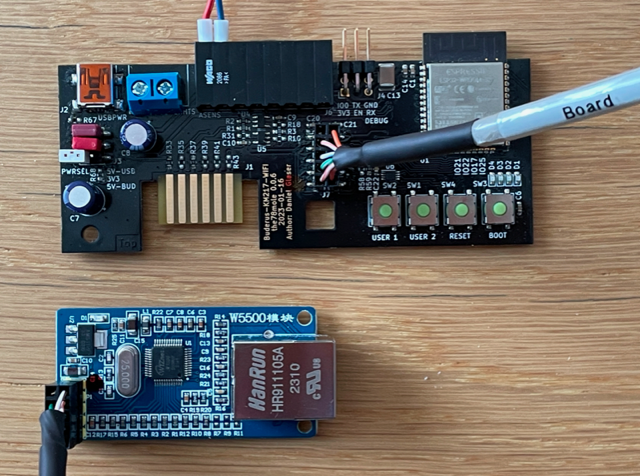

# Ethernet Module W5500

## Intro

To achieve wired connectivity with the KM271-WiFi (e.g. in concrete basements without any WiFi), we decided to
develop an Ethernet-Extension module, that is attached on the EXT (J7) connector via SPI interface.

While it is also possible to connect a W5500 Ethernet module to the Board or a generic ESP32 using Du-Pont wires
it is not suggested due to instable operation.

## Hardware Connection to KM271-WiFi

This is for the 0.0.6 and newer Boards.

| Signal | GPIO | Pin (J7) |
|--------|------|----------|
| VCC	 |      | J7.2     |
| GND	 |      | J7.10    |
| CLK    | 18	| J7.9     |
| MOSI   | 23   | J7.7     |
| MISO   | 19   | J7.5     |
| CS     | 15   | J7.3     |
| INT    | 14   | J7.8     |
| RST    | 13   | J7.6     |

A custom PCB with W5500 will soon be available...