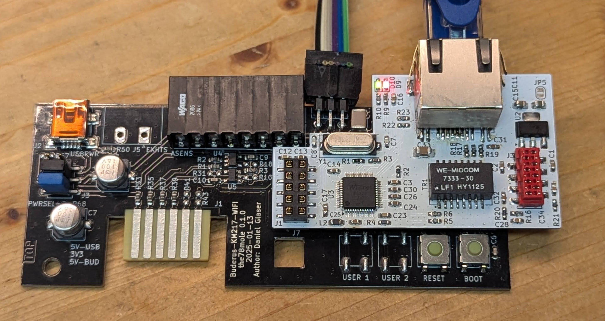
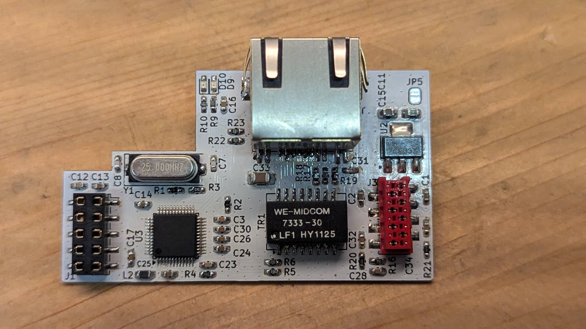
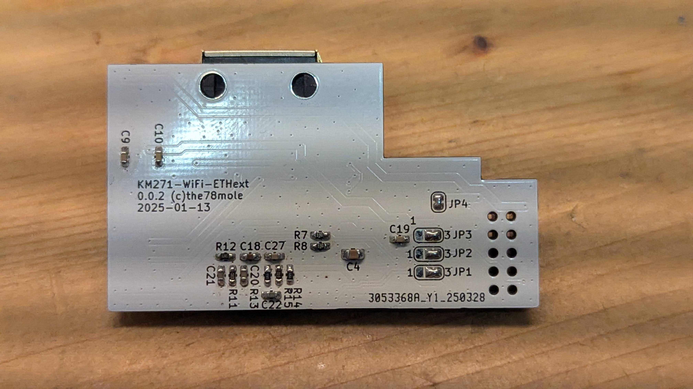
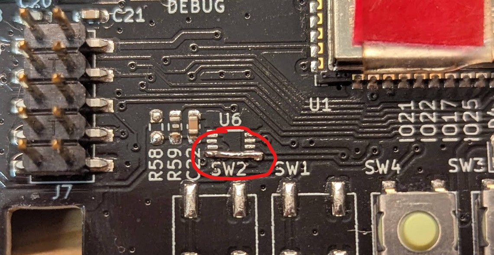
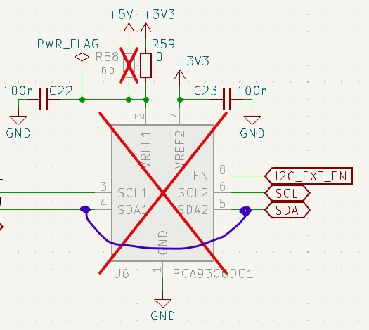
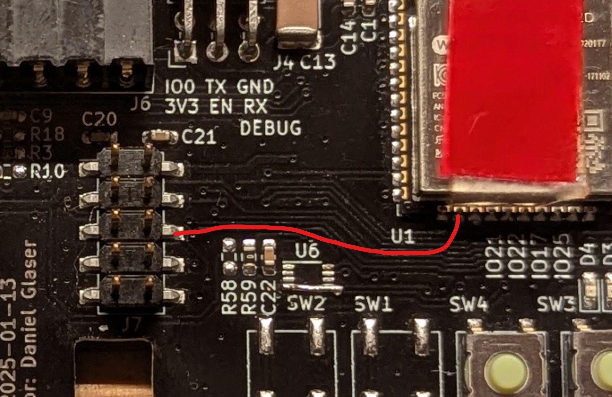
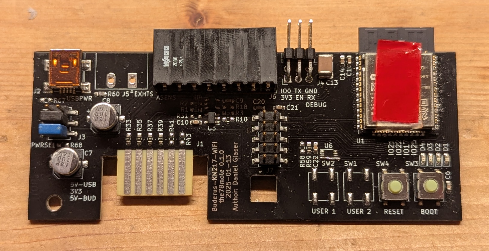

# Ethernet Module W5500



The extension itself looks like this:




## Intro

To achieve wired connectivity with the KM271-WiFi (e.g. in concrete basements without any WiFi), we decided to
develop an Ethernet-Extension module, that is attached on the EXT (J7) connector via SPI interface.


For KM271-WiFi 0.1.0, you need to add a tiny fix-bridge to make it working.




Alternatively, when not experienced with soldering, you can add a wire to the ESP and the connector foot, but you need to use an insulated one:



While it is also possible to connect a W5500 Ethernet module to the Board or a generic ESP32 using Du-Pont wires
it is not suggested due to instable operation.

## ETH-Ext Module: 

### Installation

The module needs to be mechanically fixed to and electrically insulated well from the KM271-WiFi. The space is quite dense and the easiest option is, to use some acrylic adhesive to attach it to the ESP32-WROOM-Module.



When ordering the ETH-Extension from Tindie, there is already an adhesive attached to the bootom of the Extension. Just remove the protective foil and mount it on the KM271-WiFi.

### ESPhome

For ESPhome, you need to add some configuration to the ESPhome YAML file:

```yaml
# Example configuration entry for SPI chips
ethernet:
  type: W5500
  clk_pin: 18
  mosi_pin: 23
  miso_pin: 19
  cs_pin: 15
  interrupt_pin: 14
  reset_pin: 13
```

Refer also to the [ESPhome documentation on wired ethernet](https://esphome.io/components/ethernet.html).

## DIY: W5500 Hardware Connection to KM271-WiFi

Dewenni built up a wired prototype with some W5500-Module, you can buy on aliexpress or almost anywhere else. He used the following setup for testing. This was the base for my own developed custom extension.

This is for the 0.0.6 and newer Boards.

| Signal | GPIO | Pin (J7) |
|--------|------|----------|
| VCC	 |      | J7.2     |
| GND	 |      | J7.10    |
| CLK    | 18	| J7.9     |
| MOSI   | 23   | J7.7     |
| MISO   | 19   | J7.5     |
| CS     | 15   | J7.3     |
| INT    | 14   | J7.8     |
| RST    | 13   | J7.6     |


Here's how it looks like with an external W5500-Module:


A custom PCB with W5500 will soon be available...