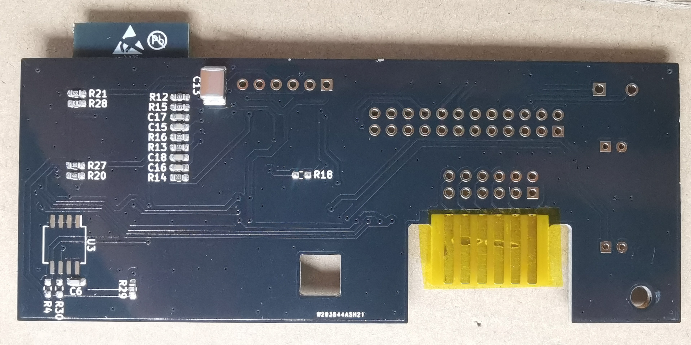
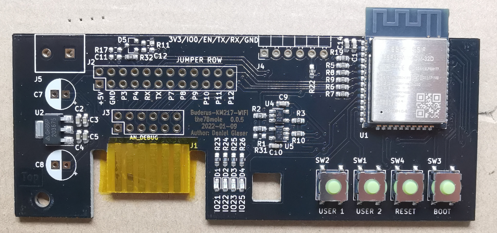
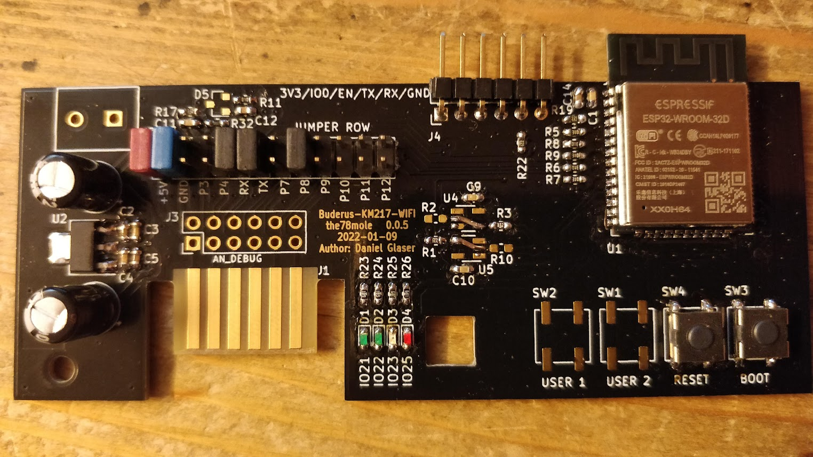

# logamatic_2107_wifi_comm

A direct KM217 replacement with WiFi connection to control a buderus heating system with Logamatic 2107 controller board.

For more details, look on my [blog post](https://the78mole.de/reverse-engineering-the-buderus-km217/) or on [tindie](https://www.tindie.com/products/the78mole/buderus-km217-wifi-replacement/).

Here is the latest picture of the 0.0.5 I received as the assembly confirmation (only SMD parts) from manufacturer:

And this is a early 0.0.5 proto hand soldered.

Here is a Version 0.0.1 board with fixes (corrected RX & TX pins of ESP32):

