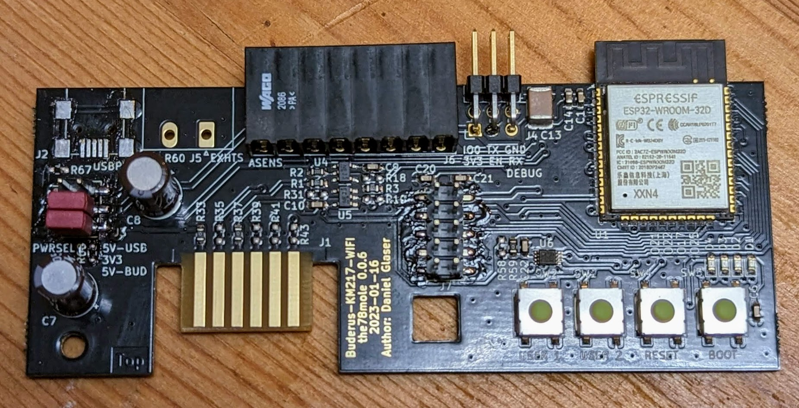
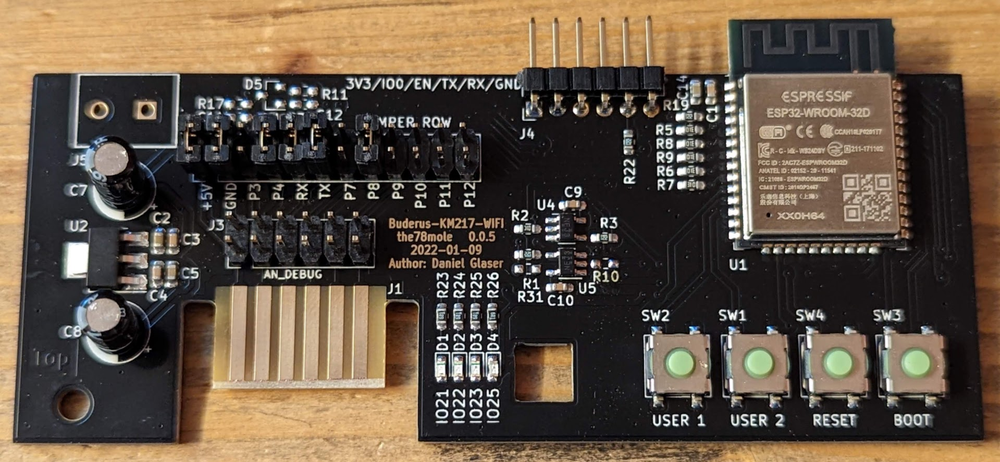

# KM271-WiFi (WiFi enabled replacement for the KM271)

    
    

This piece of hardware is a direct replacement for the Buderus KM271 to control a buderus heating system with Logamatic 2107 controller board. Maybe other controllers are supported. Please file an issue (or better a PR) if you have my module running in other Buderus heating controllers, so I can add them here.

This hardware and its documentation is released under the *TAPR Open Hardware License* Version 1.0 (May 25, 2007). 
A [copy of the license](LICENSE.txt) is included here or can be accessed in multiple formats on [tapr.org](https://tapr.org/the-tapr-open-hardware-license/). 

For more details, look on 
  
  * in the [hardware description](DOC/Hardware%20Description.md)
  * my [blog post](https://the78mole.de/reverse-engineering-the-buderus-km217/) 
  * [tindie](https://www.tindie.com/products/the78mole/buderus-km217-wifi-replacement/).

If you bought the board in my tindie store, you could find a how-to to get it running [here](https://the78mole.de/projects/km271-wifi-howto/)

This is the board as I ship it currently fully assembled (Version 0.0.6):

And here the predecessor 0.0.5:

## Improvements / ToDo

 * Add a OneWire temperature Sensor on the board itself
 * Fix a minor bug with external I2C pull-up (tie them to PCA9306 selectable supply)

