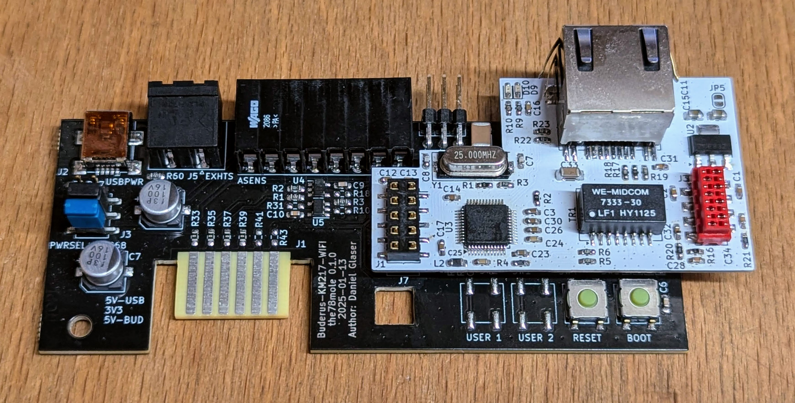

# KM271-WiFi (WiFi enabled replacement for the KM271)


[](https://github.com/the78mole/km271-wifi/releases/latest)    
    

If you just received a module, you can find help with installation here:

  - [Getting Started Guide](DOC/Getting_Started.md)
  - [Erste Schritte](DOC/Erste_Schritte.md)

This piece of hardware is a direct replacement for the Buderus KM271 to control a buderus heating system with Logamatic 2107 controller board. Maybe other controllers are supported. Please file an issue (or better a PR) if you have my module running in other Buderus heating controllers, so I can add them here.

This hardware and its documentation is released under the *TAPR Open Hardware License* Version 1.0 (May 25, 2007). 
A [copy of the license](LICENSE.txt) is included here or can be accessed in multiple formats on [tapr.org](https://tapr.org/the-tapr-open-hardware-license/). 

For more details, have a look in the:

  * [hardware description](DOC/Hardware%20Description.md)
  * [interactive BOM](https://htmlpreview.github.io/?https://github.com/the78mole/km271-wifi/blob/main/KM217-WiFi/bom/ibom_0.1.0.html)

If you bought the board in my tindie store, you could find a how-to to get it running [here](https://the78mole.de/projects/km271-wifi-howto/)


## Extensions

There is now an Extension to add wired Ethernet to the board. The prototype already works, availability in tindie store will still take some time...



## 5V Supply Calibration

I decided to set the multiplier very far off the actual value, to make it clear, that you need to calibrate it due to the inaccurate/bad design of the ESP32 ADC with a quite low input impedance and general error.
To calibrate the Buderus 5V voltage monitor, you need to first find out the YAML section of your ESPhome device. It should look like the following:

```yaml
  - platform: adc
    pin: 36
    unit_of_measurement: "V"
    name: "KM217 5V Supply"
    accuracy_decimals: 2
    update_interval: 5s
    attenuation: 6dB
    filters:
      - multiply: 28.1826
      - throttle_average: 60s
```

Now look at the readout of your sensor, say it is 47.3V and measure the real voltage of the 5V supply (e.g. Pin 1 to 7 on the sensor header), say you measure 4.9V. Use the multiplier from your YAML and do the following calculation:

    4.9V / 47.3V * 28.1826 = 2.9196

Replace the multiplier by the calculated value and you will get more exact values, close to the 5V.


## Additional Information

  - [Moles Blog - Reverse Engineering KM271](https://the78mole.de/reverse-engineering-the-buderus-km217/)
  - [Moles Blog - KM271-WiFi Project](https://the78mole.de/projects/km271-wifi-howto/)
  - [KM271-WiFi ESPhome Project (GitHub)](https://github.com/the78mole/ESPhome-KM271-WiFi)
  - [KM271-WiFi WebTools (Flashing)](https://the78mole.github.io/ESPhome-KM271-WiFi/)
  - [KM271-Firmware ESPhome Component (GitHub)](https://github.com/the78mole/esphome_components)

You can buy the module on [Tindie](https://www.tindie.com/products/the78mole/buderus-km217-wifi-replacement/) (if available).

## Star History

[](https://www.star-history.com/#the78mole/km271-wifi&Date)
