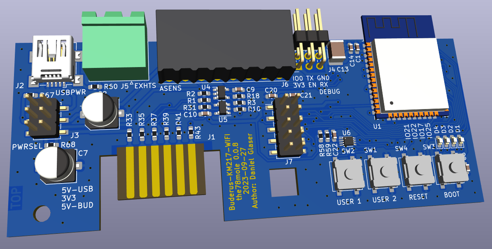

# KM271-WiFi (WiFi enabled replacement for the KM271)


[](https://github.com/the78mole/km271-wifi/releases/latest)    
    

This piece of hardware is a direct replacement for the Buderus KM271 to control a buderus heating system with Logamatic 2107 controller board. Maybe other controllers are supported. Please file an issue (or better a PR) if you have my module running in other Buderus heating controllers, so I can add them here.

This hardware and its documentation is released under the *TAPR Open Hardware License* Version 1.0 (May 25, 2007). 
A [copy of the license](LICENSE.txt) is included here or can be accessed in multiple formats on [tapr.org](https://tapr.org/the-tapr-open-hardware-license/). 

For more details, look on 
  
  * in the [hardware description](DOC/Hardware%20Description.md)
  * my [blog post](https://the78mole.de/reverse-engineering-the-buderus-km217/) 
  * [interactive BOM](https://htmlpreview.github.io/?https://github.com/the78mole/km271-wifi/blob/main/KM217-WiFi/bom/ibom_0.1.0.html)
  * [tindie](https://www.tindie.com/products/the78mole/buderus-km217-wifi-replacement/).

If you bought the board in my tindie store, you could find a how-to to get it running [here](https://the78mole.de/projects/km271-wifi-howto/)


This is a rendering of the board as it will arrive soon (Version 0.0.7):


This is the board as I shipped it lately (Version 0.0.6):


This is version 0.0.5:


## Improvements / ToDo

 * Add a OneWire temperature Sensor on the board itself
 * Fix a minor bug with external I2C pull-up (tie them to PCA9306 selectable supply)

## Firmware Management

This project includes a comprehensive firmware management system for easy firmware updates and batch production:

### 🚀 Quick Start

```bash
cd FW
./setup-dev.sh                                    # Setup development environment
uv run scripts/flash_firmware.py                  # List available firmware
uv run scripts/flash_firmware.py blinkenlights    # Flash single device
```

### 📦 Available Firmware Options

- **blinkenlights** - Local PlatformIO test project for hardware validation  
- **km271-esphome** - ESPHome-based KM271 WiFi replacement ([the78mole/ESPhome-KM271-WiFi](https://github.com/the78mole/ESPhome-KM271-WiFi))
- **dewenni-km271** - Feature-rich KM271 firmware ([dewenni/ESP_Buderus_KM271](https://github.com/dewenni/ESP_Buderus_KM271))

All firmware images are automatically downloaded and prepared for flashing using the management scripts.

### 🏭 Batch Production

For manufacturing multiple units:

```bash
uv run scripts/flash_firmware.py blinkenlights --loop
```

- Flash device → Connect next device → Press any key to continue
- Press 'n' to stop and show statistics
- Supports both ESC and 'n' for stopping

### 📖 Documentation

See [`FW/README.md`](FW/README.md) for detailed firmware management documentation, including:

- Setup instructions
- Script usage examples  
- Troubleshooting guide
- Batch production workflows

